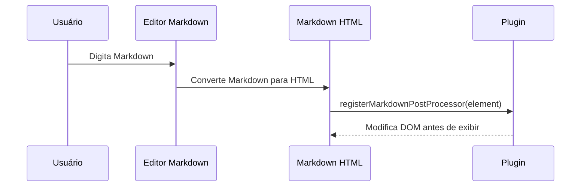

# Documentação Completa de Plugins do Obsidian

## Arquitetura do Obsidian e visão geral da API

No Obsidian, o objeto global `App` administra todas as funcionalidades centrais. Ele provê acesso às principais interfaces do sistema de plugins: **Vault** (manipulação de arquivos e pastas), **Workspace** (gerenciamento de abas/folhas), **MetadataCache** (metadados de cada nota, como cabeçalhos e links internos), entre outros【56†L298-L304】. O plugin extende a classe `Plugin`, que herda de `Component` e permite registrar comandos, ícones na barra lateral (ribbon), itens na barra de status, abas de configuração etc. Por exemplo, o plugin pode chamar `this.addCommand({ id, name, callback })` para adicionar um comando global【71†L15-L23】, ou `this.addRibbonIcon('star', 'Título', () => {/* callback */})` para inserir um ícone no ribbon 【71†L18-L24】. O `Workspace` permite navegar e criar folhas: métodos como `getActiveFile()`, `getLeavesOfType(type)`, `duplicateLeaf()`, etc., controlam o layout da UI【45†L42-L50】【45†L63-L65】. O `Vault` lida com I/O de arquivos (criar, ler, escrever, renomear) e emite eventos ao criar/modificar/renomear arquivos【43†L19-L27】【43†L43-L52】. O `MetadataCache` guarda dados de indexação (como `resolvedLinks` e `unresolvedLinks` entre arquivos【47†L9-L15】) e dispara eventos (`'changed'`, `'deleted'`) quando notas são atualizadas【47†L30-L39】. 

Internamente, o editor de texto usa *CodeMirror 6*, acessível via extensões de editor. A API também oferece classes utilitárias: `Editor` (interface comum de alto nível para o editor, com métodos como `getCursor()`, `replaceRange()`, etc.【49†L9-L17】), `DataAdapter` (I/O de baixo nível, com métodos `read`, `write`, `rename` etc【51†L6-L14】【51†L25-L33】), `PluginSettingTab` (para criar interfaces de configuração do plugin), entre outras. Em resumo, o plugin manipula tanto a interface do usuário quanto o conteúdo das notas por meio dessas APIs bem definidas.

## Estrutura do plugin e manifesto

Todo plugin possui um **`manifest.json`** e um arquivo principal compilado (ex.: `main.js`). O manifesto contém metadados cruciais. As chaves obrigatórias de plugin incluem **`id`**, **`name`**, **`author`**, **`version`**, **`description`**, **`minAppVersion`** e **`isDesktopOnly`**【7†L6-L10】【7†L16-L20】. Por exemplo:

| Campo          | Tipo           | Obrigatório | Descrição                                                                                           |
|---------------|--------------|------------|----------------------------------------------------------------------------------------------------|
| `id`          | string       | Sim        | ID único do plugin (não pode conter "obsidian"). Deve corresponder ao nome da pasta do plugin localmente【7†L16-L20】. |
| `name`        | string       | Sim        | Nome legível do plugin.                                                                            |
| `author`      | string       | Sim        | Nome do autor.                                                                                     |
| `version`     | string       | Sim        | Versão no formato SemVer `x.y.z` (ex.: `"1.0.0"`)【7†L6-L10】.                                     |
| `description` | string       | Sim        | Descrição curta do plugin.                                                                         |
| `minAppVersion` | string       | Sim        | Versão mínima do Obsidian necessária.                                                              |
| `isDesktopOnly` | boolean      | Sim        | `true` se usa APIs de Node/Electron (sofrware), ou componentes não suportados no mobile【7†L17-L20】.                     |
| `authorUrl`   | string (URL) | Não        | (Opcional) URL do site do autor.                                                                   |
| `fundingUrl`  | string ou objeto | Não   | (Opcional) Link(s) de financiamento. Pode ser string ou objeto de múltiplas fontes【7†L10-L18】.  |

Por exemplo:
```jsonc
{
  "id": "meu-plugin",
  "name": "Meu Plugin Exemplo",
  "author": "Seu Nome",
  "version": "1.0.0",
  "description": "Plugin de exemplo que faz algo.",
  "minAppVersion": "0.9.7",
  "isDesktopOnly": false
}
```
O plugin principal (tipicamente `main.ts`) deve exportar uma classe que *extends* `Plugin`. O nome dessa classe e o conteúdo do arquivo `main.js` gerado são livremente escolhidos. Dentro do plugin, `this.app` referencia o objeto global `App`. É importante obedecer às regras de nomes de comando e uso do manifest (ex.: não colocar `id` do plugin em IDs de comando, pois o Obsidian já prefixa os comandos automaticamente【10†L34-L39】【71†L15-L24】).

## Especificações da API

O SDK do Obsidian define diversas interfaces e métodos; vamos detalhar as principais funcionalidades e exemplos de uso avançado.

### Processamento de Markdown (pós-processadores e processadores de bloco)

O Obsidian permite interceptar e customizar a renderização do Markdown no modo Leitura. Para isso, use as funções `registerMarkdownPostProcessor` e `registerMarkdownCodeBlockProcessor` do plugin【58†L1-L9】【71†L70-L78】. Por exemplo, um *post-processor* registra uma função que recebe o elemento raiz de uma seção já convertida em HTML, permitindo modificar o DOM resultante. Exemplo (do guia oficial) que substitui códigos do formato `:emoji:` por um elemento `<span>` com o emoji correspondente【58†L9-L14】:
```ts
this.registerMarkdownPostProcessor((element, context) => {
  // Localiza todos os elementos <code>
  element.findAll('code').forEach((codeEl) => {
    const text = codeEl.innerText.trim();
    if (text.startsWith(':') && text.endsWith(':')) {
      const emojiSpan = codeEl.createSpan({ text: ALL_EMOJIS[text] || text });
      codeEl.replaceWith(emojiSpan);
    }
  });
});
```
Além disso, é possível criar processadores de *fenced code blocks* específicos para uma linguagem customizada. Exemplo oficial que processa blocos ```csv``` para construir uma tabela HTML【58†L23-L30】【71†L70-L78】:
```ts
this.registerMarkdownCodeBlockProcessor('csv', (source, el, ctx) => {
  const rows = source.split('\n').filter((r) => r);
  const table = el.createEl('table'); const tbody = table.createEl('tbody');
  rows.forEach(rowText => {
    const row = tbody.createEl('tr');
    rowText.split(',').forEach(col => {
      row.createEl('td', { text: col });
    });
  });
});
```
No trecho acima, `source` é o texto bruto dentro do bloco de código, e `el` é um contêiner `<div>` gerado pelo Obsidian para você preencher. O `ctx` fornece contexto adicional. Essas APIs permitem estender a sintaxe Markdown reconhecendo e renderizando novos tipos de conteúdo【58†L23-L30】【71†L70-L78】.

#### Comparação de APIs de processamento Markdown

| API                                    | Uso                                                          | Notas                       |
|----------------------------------------|-------------------------------------------------------------|-----------------------------|
| `registerMarkdownPostProcessor(fn)`    | Executa após conversão Markdown→HTML, permitindo mutar o DOM【58†L1-L9】【58†L9-L14】.       | Opera sobre o HTML renderizado. |
| `registerMarkdownCodeBlockProcessor(lang, fn)` | Trata blocos de código cercados (```lang) com a `fn(source, el, ctx)`. Remove `<pre><code>` e fornece `<div>` para saída【58†L23-L30】【71†L70-L78】. | Bom para sintaxes customizadas (ex.: CSV, diagramas). |
  
### Editor e CodeMirror 6 (Editor Extensions)

O editor de notas usa **CodeMirror 6**, permitindo *extensões de editor* para customizações no modo de edição (Live Preview). Use `this.registerEditorExtension(extensions)` no `onload()` do plugin【71†L51-L56】. As *extensions* são arrays de objetos CM6 (ex.: `ViewPlugin`, `StateField`, ou até plugins externos do CM6). Exemplo genérico do guia oficial:
```ts
onload() {
  // Registra um plugin (por exemplo, EmojiListPlugin) e campo de estado (emojiListField)
  this.registerEditorExtension([emojiListPlugin, emojiListField]);
}
```
({É necessário importar ou definir `emojiListPlugin` e `emojiListField` conforme exemplo de decorações abaixo.}).

Dentro de uma extensão de editor, pode-se usar APIs do CM6 diretamente. Para comunicar o plugin Obsidian com uma extensão de editor ou vice-versa, é possível usar o `ViewPlugin` ou lançar comandos. O Obsidian disponibiliza um objeto `view` no parâmetro de *callback* de comandos. Por exemplo, ao criar um comando de editor:  
```ts
this.addCommand({
  id: 'command-exemplo',
  name: 'Comando Exemplo (editorCallback)',
  editorCallback: (editor, view) => {
    // @ts-ignore: TypeScript não conhece view.editor.cm
    const cmView = (view.editor.cm as EditorView);
    // Obtém plugin do CM6 (ex.: um ViewPlugin classe ExamplePlugin)
    const examplePlugin = cmView.plugin(ExamplePlugin);
    if (examplePlugin) {
      examplePlugin.addPointerToSelection(cmView);
    }
  }
});
```
Esse trecho (extraído da documentação) mostra `editorCallback`, onde `editor` é o editor de texto de alto nível (obsoleto) e `view` é a `MarkdownView`. Convertendo `view.editor.cm` para `EditorView` do CM6 via casting (usando `@ts-ignore`), podemos interagir com a extensão de editor registrada【68†L11-L19】. 

### Decorações no Editor (Widgets, Marcações, Linhas)

Para modificar visualmente o conteúdo do editor, utiliza-se **decorações** do CodeMirror 6. Elas incluem *mark* (estilizar trechos de texto), *widget* (inserir elementos HTML no fluxo), *replace* (substituir trechos com widgets), e *line* (decorar linhas inteiras)【70†L15-L23】. Essas decorações são definidas dentro de extensões (via `StateField` ou `ViewPlugin`). 

Por exemplo, para inserir um emoji em listas, define-se um `WidgetType` customizado:
```ts
import { WidgetType, Decoration } from '@codemirror/view';
class EmojiWidget extends WidgetType {
  toDOM(view: EditorView): HTMLElement {
    const span = document.createElement('span');
    span.innerText = '🔥'; // emoji de exemplo
    return span;
  }
}
const emojiWidgetDeco = Decoration.replace({ widget: new EmojiWidget() });
```
Em seguida, inclui-se essa decoração numa extensão. Pode-se usar um `StateField` que fornece um `DecorationSet` com essas decorações【70†L61-L69】, ou um `ViewPlugin` que atualiza as decorações no método `update`【70†L79-L88】. Por exemplo, no `StateField.define` do guia oficial, a função `update` itera pela `syntaxTree` do documento e constrói `RangeSetBuilder` adicionando `Decoration.replace({ widget: new EmojiWidget() })` nas posições desejadas【70†L69-L77】. Já no exemplo de `ViewPlugin`, o construtor e `update` chamam uma função `buildDecorations(view)` que retorna `DecorationSet` usando `syntaxTree` e `RangeSetBuilder`【70†L83-L92】.

Essas decorações permitem, por exemplo, realçar erros ortográficos, adicionar botões embutidos, destacar linhas, etc. A seguir estão alguns tipos comuns:
- **Widget Decoration**: insere ou substitui conteúdo por um elemento DOM customizado (como o span de emoji acima)【70†L53-L60】.  
- **Mark Decoration**: aplica estilo a um intervalo existente de texto (ex.: fundo colorido).  
- **Line Decoration**: aplica estilo a uma linha inteira (ex.: borda lateral).  

#### Exemplo de decorações (Widgets e StateField)

```ts
// Widget que exibe 🔥
class FireWidget extends WidgetType {
  toDOM(view: EditorView): HTMLElement {
    const el = document.createElement('span');
    el.innerText = '🔥';
    return el;
  }
}
// Campo de estado para gerenciar decorações
export const fireField = StateField.define<DecorationSet>({
  create() { return Decoration.none; },
  update(decoSet, tr) {
    let builder = new RangeSetBuilder<Decoration>();
    // Exemplo simplificado: sempre adiciona o widget no início
    if (tr.state.doc.lines > 0) {
      builder.add(0, 1, Decoration.replace({ widget: new FireWidget() }));
    }
    return builder.finish();
  },
  provide: field => EditorView.decorations.from(field)
});
```
Esse campo (`fireField`) provê decorações que, neste exemplo hipotético, adicionam um emoji no início do documento. Na prática, `update` checaria `syntaxTree` ou outras condições para posicionar widgets relevantes.

### Comandos avançados (editorCallback)

Além dos comandos normais (`addCommand` com `callback`), é possível usar `editorCallback` para editar diretamente o texto no editor corrente. Nessa forma, o callback recebe duas referências: o objeto `editor` e a `MarkdownView`. Por exemplo, pode-se inserir texto na posição atual do cursor:
```ts
this.addCommand({
  id: 'insert-hello',
  name: 'Inserir Hello no Editor',
  editorCallback: (editor, view) => {
    // '@ts-ignore' pois editor é do tipo Editor
    editor.replaceSelection('Hello');
  }
});
```
Aqui, `replaceSelection` do `Editor` insere `"Hello"` onde estiver o cursor. Entre APIs do editor, destacam-se: `getSelection()`, `setSelection(anchor, head)`, `getCursor()`, `setCursor(pos)`, `replaceRange(text, from, to)`, entre outros【49†L9-L17】. Por exemplo, `editor.getCursor()` retorna posição atual (lin, col) e `editor.setSelection(anchor, head)` move a seleção. Essas operações só fazem sentido no editor (modo Edição ou Live Preview) e não são aplicáveis na visualização Markdown pura.

### Sugestões e completions (EditorSuggest)

O Obsidian suporta caixas de sugestão automáticas (“*EditorSuggest*”). Um plugin pode registrar um `EditorSuggest` estendendo essa classe e depois usar `this.registerEditorSuggest(mySuggest)`【71†L55-L59】. Essa funcionalidade permite oferecer completions ao usuário digitando (semelhante ao autocomplete). A configuração detalhada envolve implementar métodos como `onTrigger(cursor, editor)` e `onChoose(item, evt)` no `EditorSuggest`. (Detalhes avançados não estão presentes na documentação oficial; consulte exemplos de plugins de sugestão na comunidade). 

### Views customizadas

O Obsidian permite criar novas **views** (páginas) customizadas no workspace. Para isso, registre um tipo de view com `registerView(type, creator)`【74†L3-L8】, onde `type` é um identificador único e `creator` é uma função que recebe um `WorkspaceLeaf` e retorna uma instância de `ItemView` (subclasse apropriada). Exemplo (esquemático):
```ts
this.registerView('exemplo-view', leaf => new ExampleView(leaf));
```
Dentro da classe `ExampleView extends ItemView`, implementa-se métodos como `getViewType()`, `getDisplayText()`, `onOpen()`, `onClose()`. Isso permite renderizar conteúdos personalizados em abas do Obsidian (ex.: painéis de visualização de dados, gráficos, etc.). As *views* se integram ao fluxo de layout do workspace, e podem responder aos eventos de abertura/fechamento no workspace.  

## Guia do desenvolvedor: Configuração, Build, Empacotamento e Publicação

### Setup e Build

- **Ferramentas requeridas:** Git, Node.js (versão LTS) e npm. Edite em TypeScript de preferência.  
- **Template oficial:** Use o [obsidian-plugin-template](https://github.com/obsidianmd/obsidian-plugin-template) ou clone o [obsidian-sample-plugin](https://github.com/obsidianmd/obsidian-sample-plugin)【6†L21-L24】.  
- **Instalação e compilação:** No diretório do plugin, execute `npm install` e `npm run dev`. O segundo mantêm a compilação automática de `main.ts` → `main.js`【6†L31-L35】.  
- **Teste do plugin:** Copie a pasta compilada (com `manifest.json`, `main.js`, e opcionalmente `styles.css`) para `Vault/.obsidian/plugins/`. No Obsidian, ative **Community plugins** e habilite seu plugin na lista. Use “Reload app without saving” ou desativar/reativar para recarregar após mudanças.

### Empacotamento e Publicação

1. **GitHub Release:** Atualize `version` no `manifest.json`. Crie uma *release* no GitHub com a tag correspondente, subindo `main.js`, `manifest.json` e `styles.css`.  
2. **Adicionar ao repositório oficial:** Faça um PR no [community-plugins.json](https://github.com/obsidianmd/obsidian-releases/blob/master/community-plugins.json) no repositório obsidian-releases. Insira uma entrada JSON com `{ "id", "name", "author", "description", "repo" }` conforme o manifesto【9†L42-L50】【29†L347-L356】. Aguarde validação automática e revisão.  
3. **Revisão:** Responda feedback do time. Plugins aprovados são disponibilizados no browser interno do Obsidian.

### Exemplos de plugins

- **Hello World:** já visto nos exemplos acima.  
- **Uso de ribbon icon e notificação:**  
  ```ts
  this.addRibbonIcon('dice', 'Saudar', () => {
    new Notice('Olá, mundo!');
  });
  ```  
- **Status bar:** Para adicionar itens na barra inferior (somente no desktop)【71†L21-L23】【78†L1-L10】. Exemplo:
  ```ts
  const item = this.addStatusBarItem();
  item.createEl('span', { text: 'Status ativo' });
  ```
  *Nota:* No celular, itens de status bar customizados **não são suportados**【78†L3-L6】.  

- **Guia de configurações:** Subclasses de `PluginSettingTab` permitem criar UI de opções. Exemplo de uso de `Setting` (como mostrado na seção anterior).  

- **Exibição de gráficos ou visuais:** Plugins podem usar bibliotecas JS (ex.: D3, Chart.js) em _post-processors_ ou _Views_.  

- **Interação de rede:** O plugin pode usar `fetch()` ou outras APIs web padrão para requisições HTTP (não documentado oficialmente, mas permitido no ambiente Node/Electron do Obsidian desktop). Em mobile, recomenda-se garantir conexão e talvez usar APIs específicas.

## Requisitos de submissão e melhores práticas

- **Conformidade com políticas:** Plugins devem seguir [padrões de UI/texto e segurança](https://docs.obsidian.md/Developer+policies) e diretrizes de submissão【10†L5-L13】【12†L48-L57】. Por exemplo, não inclua código de exemplo do template, escreva descrições concisas e em português correto, e defina `minAppVersion` adequadamente【10†L9-L13】【10†L13-L19】.  
- **Node/Electron e móvel:** Se usar APIs nativas (filesystem, `fs`, `crypto`, etc.), marque `"isDesktopOnly": true` no manifest【10†L25-L28】. Lembre que certos elementos de UI não funcionam no app móvel (ex.: itens de status bar)【78†L3-L6】.  
- **Limpeza de recursos:** Sempre use `this.registerEvent`, `registerDomEvent`, `registerInterval` para garantir limpeza automática de listeners ao descarregar【26†L319-L327】.  
- **Recomendações de código:** Evite usar `innerHTML` (prefira `createEl`), manipule o DOM com métodos seguros【12†L48-L57】, e minimize logs no console. Use idioma português correto no plugin e siga orientação de texto do Obsidian (sentence case)【12†L38-L44】.

## Depuração e Permissões

- **Modo restrito:** Por segurança, o Obsidian inicia em *Restricted Mode*. O usuário deve explicitamente habilitar plugins de comunidade em `Settings → Community plugins`. Plugins habilitados ficam **ignorados** enquanto o modo restrito estiver ativo【54†L4-L11】.  
- **Privilegios de plugins:** Plugins rodam com privilégios totais do ambiente Node/Electron. Eles podem acessar o sistema de arquivos do usuário, rede e outros recursos indefinidamente【54†L12-L18】. Não existe controle granular de permissões: portanto, instale plugins de fontes confiáveis e, se necessário, revise o código fonte ou peça auditoria.  

## Formato do manifesto (`manifest.json`)

Recapitulando, o manifest deve obedecer o *schema* do Obsidian【7†L3-L11】【7†L13-L19】. Eis os campos-chave de plugin:

- **Gerais (plugins & temas):** `name`, `author`, `version`, `minAppVersion`, `authorUrl`, `fundingUrl`.  
- **Plugins:** `id`, `description`, `isDesktopOnly`.  

Por exemplo:  

| Campo          | Descrição                                     |
|---------------|-----------------------------------------------|
| `isDesktopOnly` | (boolean) Se `true`, só usa APIs desktop (filesystem, módulos nativos). Caso contrário, o plugin está disponível em mobile.    |
| `id`           | (string) ID único do plugin, igual ao da pasta. |
| `minAppVersion`| Versão mínima do Obsidian necessária.         |

Como visto, `addStatusBarItem()` adiciona itens apenas no desktop【71†L21-L23】【78†L3-L6】. Portanto, se seu plugin usar status bar ou outros componentes desktop-only, defina `isDesktopOnly: true`.

## Diagramas de fluxo (Mermaid)

### Ciclo de vida do plugin

```mermaid
graph LR
  A[Plugin Desabilitado] --> B[Usuário habilita plugin]
  B --> C[Obsidian chama onload()]
  C --> D[Plugin ativo: executa comandos/eventos]
  D --> E[Usuário desabilita plugin ou fecha app]
  E --> F[Obsidian chama onunload()]
  F --> A[Plugin descarregado]
```

### Pipeline de renderização de Markdown



Este diagrama ilustra como, após a conversão Markdown→HTML, o *post-processor* (`registerMarkdownPostProcessor`) recebe o elemento HTML (preview) para ajustes finais【58†L1-L9】【58†L9-L14】.

## Notas de versão e migrações

Mudanças no Obsidian podem alterar a API. Consulte o [CHANGELOG do obsidian-api](https://github.com/obsidianmd/obsidian-api/blob/master/CHANGELOG.md) para detalhes. Por exemplo, novas versões podem introduzir métodos (ex.: `onUserEnable()` na 1.7.2【71†L31-L36】) ou requisitos de versão mínima. **Não encontramos nas fontes oficiais** um guia de migração detalhado além das notas de versão; recomenda-se testar o plugin com cada nova versão do Obsidian e ajustar o `minAppVersion` conforme necessário.

Todas as especificações e exemplos acima são baseados nos documentos oficiais (developer docs, TypeScript definitions e guias do Obsidian) citados ao longo do texto. Questões não abordadas nas fontes oficiais foram marcadas como não especificadas ou abordadas com base na arquitetura geral do Obsidian.
